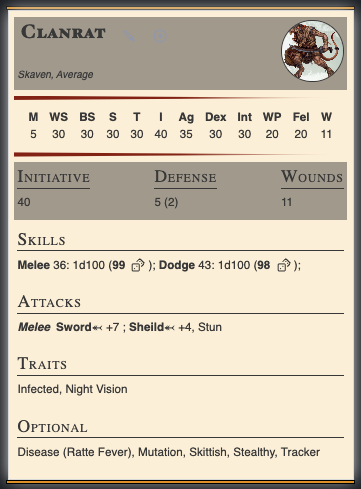

[[Fantasy Statblocks|Fantasy Statblocks]] > [[Integrated Layouts|Integrated Statblock Layouts]] > *You Are Here*

---

## Description

*Statblocks for warhammer fantasy roleplay 4e*

*Do you have any special callbacks you are using? No*

*Any licences required by the publisher? Cubicle 7?*

## Sample Image

> 

## Short Name Code Block

````yaml
```statblock
columns: 2
forcecolumns: true
layout: warhammer-fantasy-4e
image: bestiary-zombies.png
source: "BRB"

name: "Zombie"
size: "Average"
type: "Undead" 
stats: [4, 15, -, 30, 30, 5, 10, 15, -, -, -, 12]
initiative: 5
defense: 3 / 5(2)
hp: 12

skills:
 - name: ""
   desc: "__Melee__ 19: 19 (1d100); __Dodge__ 14: 14 (1d100);"

traits: 
 - name: ""
   desc: "Construct, Dark Vision, Fear 2, Painless, Undead, Unstable"

optional:
 - name: ""
   desc: "Construct, Dark Vision, Fear 2, Painless, Undead, Unstable"

attacks:
 - name: "Melee"
   desc: "__Sword__⬻ +7 ; __Sheild__⬻ +4"

spells:
- name: "Spells"
  desc: "Causes Fear; Crumble"

```
````


### Short Name Empty Codeblock

````yaml
```statblock
columns: 2
forcecolumns: true
layout: warhammer-fantasy-4e
image: bestiary-zombies.png
source: "BRB"

```
````


```
